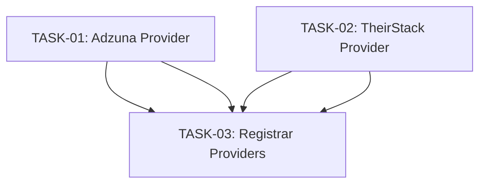

# BR Providers — Tasks Index

## Visão Geral

Implementação de dois novos provedores de vagas brasileiros (Adzuna e TheirStack) no backend do JobFindr, seguido do registro no provider loader.

## Tasks

| # | Task | Descrição | Agente | Dependências |
|---|------|-----------|--------|-------------|
| 01 | Implementar Provedor Adzuna | Criar provider Adzuna estendendo ApiProvider com search, field mapping, factory, testes e env vars | Senior Backend | Nenhuma |
| 02 | Implementar Provedor TheirStack | Criar provider TheirStack estendendo ApiProvider com search, field mapping, throttle, factory, testes e env vars | Senior Backend | Nenhuma |
| 03 | Registrar Provedores no Provider Loader | Adicionar Adzuna e TheirStack no loadAll() e loadByName() do provider-loader.ts | Senior Backend | TASK-01, TASK-02 |

## Ordem de Execução

## Diagrama de Dependências

- **TASK-01** e **TASK-02** podem ser executados **em paralelo** — não possuem dependências entre si.
- **TASK-03** depende da conclusão de **ambas TASK-01 e TASK-02** — só pode ser executada após ambas estarem completas.

## Estratégia de Execução

1. **Fase 1 (paralelo)**: Senior Backend executa TASK-01 e TASK-02 simultaneamente (ou em qualquer ordem)
2. **Fase 2 (sequencial)**: Senior Backend executa TASK-03 após ambas as tarefas da Fase 1 estarem completas

## Notas

- Todas as tarefas são exclusivamente **backend** — não há alterações no frontend
- Cada provider segue o padrão estabelecido: `extends ApiProvider` + `normalizeJob()` + `withRetry()` + factory function
- As variáveis de ambiente devem ser adicionadas em 3 lugares: `env.ts`, `.env.example` e `.env`
- O registro no provider-loader segue o padrão de `try/catch` já utilizado pelos provedores existentes
