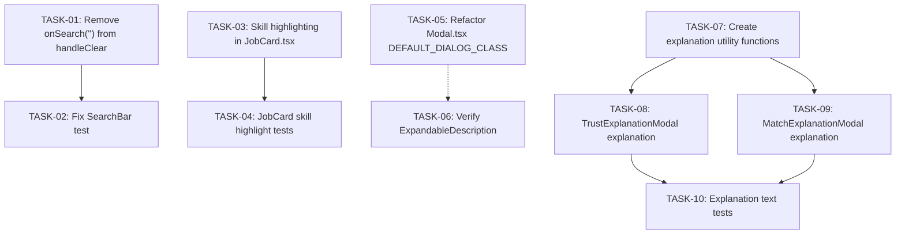

# Tasks — Four UI Fixes

**Context:** `four-ui-fixes-analysis`
**Date:** 2026-06-03
**Allocation:** All tasks → Senior Frontend (no backend changes required)

## Overview

Four independent frontend-only UI fixes for the JobFindr search aggregator. All tasks are low-risk, independently implementable, and require no backend modifications.

## Execution Order & Dependencies

The four epic groups are fully independent (no cross-epic dependencies). Within each epic group, test tasks depend on implementation tasks.

## Task Table

| ID | Task | Epic | Effort | Depends On |
|----|------|------|--------|------------|
| TASK-01 | Remove `onSearch("")` from `handleClear` in `SearchBar.tsx` | EPIC-01 | ~5 min | — |
| TASK-02 | Update `SearchBar.test.tsx` — fix buggy-behavior test | EPIC-01 | ~5 min | TASK-01 |
| TASK-03 | Import `useSearchStore` and add conditional skill highlighting in `JobCard.tsx` | EPIC-02 | ~30 min | — |
| TASK-04 | Add tests for skill highlighting in `JobCard.test.tsx` | EPIC-02 | ~15 min | TASK-03 |
| TASK-05 | Refactor `Modal.tsx` — add `DEFAULT_DIALOG_CLASS` default parameter | EPIC-03 | ~15 min | — |
| TASK-06 | Verify `ExpandableDescription.tsx` `MODAL_DIALOG_CLASS` works correctly | EPIC-03 | ~10 min | TASK-05 |
| TASK-07 | Create `buildTrustExplanation()` and `buildMatchExplanation()` utility functions | EPIC-04 | ~20 min | — |
| TASK-08 | Add explanation paragraph to `TrustExplanationModal.tsx` | EPIC-04 | ~15 min | TASK-07 |
| TASK-09 | Add explanation paragraph to `MatchExplanationModal.tsx` | EPIC-04 | ~15 min | TASK-07 |
| TASK-10 | Add tests for explanation text rendering in both modals | EPIC-04 | ~20 min | TASK-08, TASK-09 |

**Total estimated effort:** ~2.5 hours

## Grouped by Epic

### EPIC-01: Search Bar Bug Fix
- **TASK-01** → Remove `onSearch("")` from `handleClear`
- **TASK-02** → Update test to expect no `onSearch` call on clear

### EPIC-02: Job Card Skill Highlighting
- **TASK-03** → Conditional skill badge styling based on `useSearchStore.userSkills`
- **TASK-04** → Tests for skill matching (case-insensitive, empty state)

### EPIC-03: Modal Sizing Fix
- **TASK-05** → Refactor `Modal.tsx` with `DEFAULT_DIALOG_CLASS` constant
- **TASK-06** → Verify `ExpandableDescription.tsx` modal sizing works

### EPIC-04: Trust & Match Explanation Text
- **TASK-07** → Create utility functions `buildTrustExplanation()` and `buildMatchExplanation()`
- **TASK-08** → Add explanation paragraph to `TrustExplanationModal.tsx`
- **TASK-09** → Add explanation paragraph to `MatchExplanationModal.tsx`
- **TASK-10** → Add tests for explanation text rendering in both modals

## Agent Allocation

| Agent | Tasks |
|-------|-------|
| **Senior Frontend** | TASK-01, TASK-02, TASK-03, TASK-04, TASK-05, TASK-06, TASK-07, TASK-08, TASK-09, TASK-10 |
| **Senior Backend** | (none) |
