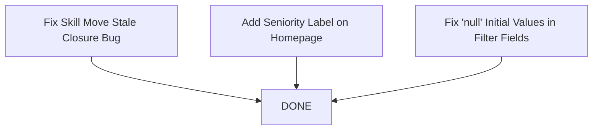

# Homepage Fixes — Tasks

> Frontend-only tasks for three independent homepage fixes. All tasks are assigned to **Senior Frontend**.

## Task Overview

| ID | Title | Epic | Effort | Dependencies |
|----|-------|------|--------|-------------|
| TASK-HF-01 | Fix Skill Move Stale Closure Bug | EPIC-01-fix-skill-move-bug | ~2 lines, 1 file | None |
| TASK-HF-02 | Add Seniority Label on Homepage | EPIC-02-add-seniority-label | ~5 lines, 1 file | None |
| TASK-HF-03 | Fix "null" Initial Values in Filter Fields | EPIC-03-fix-null-filter-values | ~10 lines, 2 files | None |

## Execution Order

All three tasks are **independent** and can be executed in **any order or in parallel**.

## Dependency Graph

No circular dependencies. All tasks are leaf nodes.

## Agent Assignment

| Task | Assigned Agent |
|------|---------------|
| TASK-HF-01 | Senior Frontend |
| TASK-HF-02 | Senior Frontend |
| TASK-HF-03 | Senior Frontend |

## Files Changed

| File | Task | Change |
|------|------|--------|
| `apps/frontend/src/components/Layout.tsx` | TASK-HF-01 | Use `getState()` to read fresh `userSkills` |
| `apps/frontend/src/components/FiltersPanel.tsx` | TASK-HF-02 | Add seniority label below SenioritySelector |
| `apps/frontend/src/store/searchStore.ts` | TASK-HF-03 | Add persist migration v1 (null arrays → `[]`) |
| `apps/frontend/src/components/AutocompleteInput.tsx` | TASK-HF-03 | Null coalescing on value prop |

## References

- [Epics index](../epics/index.md)
- [Feasibility Analysis](../feasibility.md)
- [Impact Analysis](../impact-analysis.md)
- [Risks](../risks.md)
- [Recommendations](../recommendations.md)
