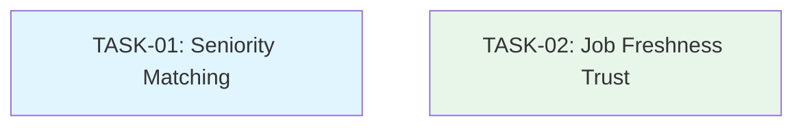

# Job Matching Algorithm Fixes — Tasks Overview

**Context:** `job-matching-analysis`  
**Date:** Thu Jun 04 2026  
**Status:** Ready for Development

## Overview

This folder contains technical tasks derived from two independent epics addressing job matching algorithm issues:

1. **Seniority mismatch under-penalization** (EPIC-01)
2. **Job freshness not affecting trust score** (EPIC-02)

Both tasks are **backend-only**, **independent**, and can be executed **in parallel** by different developers.

## Task Summary

| Task ID | Title | Layer | Epic Origin | Effort | Dependencies |
|---------|-------|-------|-------------|--------|--------------|
| **TASK-01** | Improve Seniority Matching Penalties | backend | EPIC-01 | Small (1-2 days) | None |
| **TASK-02** | Incorporate Job Freshness into Trust Score | backend | EPIC-02 | Medium (2-3 days) | None |

## Dependency Graph

**No dependencies exist between tasks.** Both can start immediately and run in parallel.

## Execution Order

Since tasks are independent with no dependencies, the recommended execution order is:

1. **Parallel execution** — Assign TASK-01 and TASK-02 to different backend developers
2. **If sequential** — Either order works; no blocking concerns

### Suggested Parallel Assignment

- **Developer A (Backend):** TASK-01 — Matchmaking weight adjustments
- **Developer B (Backend):** TASK-02 — Trust score freshness component

## Agent Allocation

| Task | Assigned Agent |
|------|----------------|
| TASK-01 | Senior Backend Developer |
| TASK-02 | Senior Backend Developer |

Both tasks require **Senior Backend Developer** skills (TypeScript, Fastify, testing with vitest).

## Cross-Task Acceptance Criteria

- [ ] All unit tests pass (`pnpm --filter backend test`)
- [ ] No breaking API changes
- [ ] Match scores and trust scores change numerically but preserve relative job rankings
- [ ] Existing cached scores recalculated on next search (stateless architecture)
- [ ] No performance regression

## File References

- Epics: `.opencode/plan/job-matching-analysis/epics/`
  - `EPIC-01-improve-seniority-matching.md`
  - `EPIC-02-incorporate-job-freshness-trust.md`
- Tasks: `.opencode/plan/job-matching-analysis/tasks/`
  - `TASK-01-improve-seniority-matching.md`
  - `TASK-02-incorporate-job-freshness-trust.md`

## Notes

- Both epics are **additive changes** — no API contract modifications
- Stateless architecture means no migration needed; scores recalculated on next search
- Consider future configuration for weights if frequent tuning is needed
- Tasks follow the convention: same-agent dependent work combined into single task files