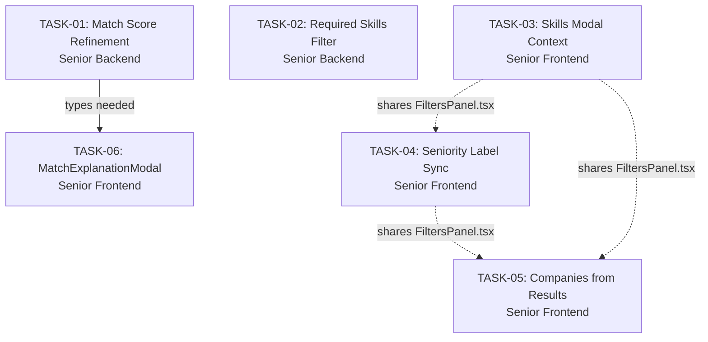

# Tasks — Match & Filters Analysis

**Context:** `match-filters-analysis`
**Created:** 2026-06-06
**Total tasks:** 6 (2 backend, 4 frontend)

---

## Overview

This task set implements 5 changes derived from the match-filters-analysis planning phase:

| Change | Task | Layer | Effort |
|--------|------|-------|--------|
| 1. Match Score Refinement | TASK-01 + TASK-06 | Backend + Types + Frontend | Medium |
| 2. "Your Skills" Clickable | TASK-03 | Frontend | Small |
| 3. Seniority Label Sync | TASK-04 | Frontend | Trivial |
| 4. Required Skills Exclusivity | TASK-02 | Backend | Small |
| 5. Companies from Results | TASK-05 | Frontend | Small |

---

## Task List

| ID | Title | Agent | Status |
|----|-------|-------|--------|
| TASK-01 | Match Score Calculation Refinement | Senior Backend | Pending |
| TASK-02 | Required Skills Filter Exclusivity | Senior Backend | Pending |
| TASK-03 | "Your Skills" Filter Clickable — SkillsModalContext | Senior Frontend | Pending |
| TASK-04 | Seniority Label with Sync | Senior Frontend | Pending |
| TASK-05 | Companies Filters Reflecting Actual Results | Senior Frontend | Pending |
| TASK-06 | MatchExplanationModal Work Type Display | Senior Frontend | Pending |

---

## Dependency Graph



**Arrow** = hard dependency (task must complete first)
**Dotted line** = shared file — sequential execution recommended to avoid merge conflicts

### Dependency Details

- **TASK-06 → TASK-01**: TASK-06 requires the `workTypeMatch` field added to `MatchBreakdown` by TASK-01. The frontend cannot import the new field until the types package is rebuilt.
- **TASK-03, TASK-04, TASK-05**: All three modify `FiltersPanel.tsx`. While logically independent, they share the same file. Recommended to execute sequentially to avoid merge conflicts. Any order works, but executing them consecutively without parallel edits avoids conflict resolution.

---

## Execution Order

### Phase 1 — Backend (parallel)
```
TASK-01 ───────────────────────────────────── TASK-06 (starts after TASK-01)
TASK-02 (independent)
```

### Phase 2 — Frontend (sequential on FiltersPanel.tsx, TASK-06 after TASK-01)
```
TASK-03 → TASK-04 → TASK-05 → (wait for TASK-01) → TASK-06
```

### Recommended pipeline execution

| Step | Tasks | Rationale |
|------|-------|-----------|
| Senior Backend | TASK-01 + TASK-02 | No shared files; can be done in parallel or sequentially |
| Senior Frontend (part 1) | TASK-03 → TASK-04 → TASK-05 | Sequential to avoid merge conflicts on FiltersPanel.tsx |
| Senior Frontend (part 2) | TASK-06 | Must wait for TASK-01 types to be published |

> **Note**: TASK-03, TASK-04, and TASK-05 are independent features. If the agent prefers, they can also be implemented in a combined branch to minimize merge overhead — the key requirement is avoiding parallel edits to `FiltersPanel.tsx`.

---

## Agent Allocation

| Agent | Tasks | Total Files Changed |
|-------|-------|-------------------|
| **Senior Backend** | TASK-01, TASK-02 | 4 files (weighted-match-scoring.ts, aggregation-service.ts, match.types.ts) |
| **Senior Frontend** | TASK-03, TASK-04, TASK-05, TASK-06 | 7 files (SkillsModalContext.tsx, main.tsx, Layout.tsx, FiltersPanel.tsx, HomePage.tsx, CompanyFilters.tsx, MatchExplanationModal.tsx) |

---

## Shared File Matrix

| File | TASK-01 | TASK-02 | TASK-03 | TASK-04 | TASK-05 | TASK-06 |
|------|---------|---------|---------|---------|---------|---------|
| `packages/types/src/match.types.ts` | ✅ | | | | | |
| `weighted-match-scoring.ts` | ✅ | | | | | |
| `aggregation-service.ts` | ✅ | ✅ | | | | |
| `contexts/SkillsModalContext.tsx` | | | ✅ | | | |
| `main.tsx` | | | ✅ | | | |
| `Layout.tsx` | | | ✅ | | | |
| `FiltersPanel.tsx` | | | ✅ | ✅ | ✅ | |
| `HomePage.tsx` | | | | | ✅ | |
| `CompanyFilters.tsx` | | | | | ✅ | |
| `MatchExplanationModal.tsx` | | | | | | ✅ |

---

## Risk Notes

1. **Breaking change — TASK-01**: Match scores will shift for all jobs. Communicate score formula changes.
2. **Breaking change — TASK-02**: Jobs missing required skills will now be excluded. This changes existing search behavior.
3. **Breaking change — TASK-05**: Company suggestions show only current results, not global cache. Graceful fallback to global suggestions on empty state.
4. **FiltersPanel.tsx conflicts**: TASK-03, TASK-04, and TASK-05 all modify `FiltersPanel.tsx`. Execute sequentially.
5. **TASK-06 timing**: Must happen after TASK-01 types are published. The frontend agent should complete TASK-03/04/05 first, then do TASK-06.

## References
- `.opencode/plan/match-filters-analysis/index.md` — Analysis overview
- `.opencode/plan/match-filters-analysis/feasibility.md` — Technical feasibility and approaches
- `.opencode/plan/match-filters-analysis/impact-analysis.md` — Layer impact and breaking changes
- `.opencode/plan/match-filters-analysis/risks.md` — Risk register and mitigation
