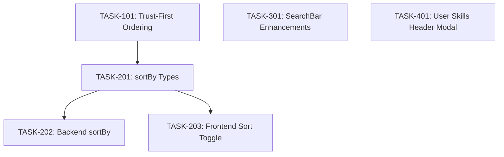

# UX Improvements — Task Overview

**Context:** `.opencode/plan/prioridades-ux/tasks/`
**Date:** 2026-05-31
**Status:** Draft

## Execution Order

```
Phase 1 (Sorting foundation):
  TASK-101  ← Epic 1, backend only, no deps
      ↓
  TASK-201  ← Epic 2, types only, depends on TASK-101
      ↓
  TASK-202  ← Epic 2, backend ranking, depends on TASK-201
  TASK-203  ← Epic 2, frontend UI, depends on TASK-201 (parallel with TASK-202)
      ↓
Phase 2 (Search — independent, parallel with Phase 1):
  TASK-301  ← Epic 3, frontend only, no deps
      ↓
Phase 3 (Skills — independent, parallel with Phase 1 & 2):
  TASK-401  ← Epic 4, frontend only, no deps
```

## Task Table

| ID | Name | Epic | Layer | Agent | Depends on | Effort |
|----|------|------|-------|-------|------------|--------|
| TASK-101 | Trust-First Default Ordering | Epic 1 | Backend | Senior Backend | None | Small |
| TASK-201 | Add sortBy to Shared Types | Epic 2 | Types | Senior Backend | TASK-101 | Small |
| TASK-202 | Add sortBy Support to Backend Ranking | Epic 2 | Backend | Senior Backend | TASK-201 | Medium |
| TASK-203 | Create Sort Toggle UI | Epic 2 | Frontend | Senior Frontend | TASK-201 | Medium |
| TASK-301 | Enhance SearchBar with Visual Indicator & Suggestions | Epic 3 | Frontend | Senior Frontend | None | Medium |
| TASK-401 | Move Your Skills to Header Modal | Epic 4 | Frontend | Senior Frontend | None | Medium |

## Agent Allocation

| Agent | Tasks |
|-------|-------|
| **Senior Backend** | TASK-101, TASK-201, TASK-202 |
| **Senior Frontend** | TASK-203, TASK-301, TASK-401 |

## Dependency Graph (Mermaid)



## Epic Origin Mapping

| Task ID | Epic Source File |
|---------|-----------------|
| TASK-101 | `epics/epic-1-trust-first-ordering.md` |
| TASK-201 | `epics/epic-2-sort-toggle.md` |
| TASK-202 | `epics/epic-2-sort-toggle.md` |
| TASK-203 | `epics/epic-2-sort-toggle.md` |
| TASK-301 | `epics/epic-3-search-bar-improvements.md` |
| TASK-401 | `epics/epic-4-user-skills-header.md` |
