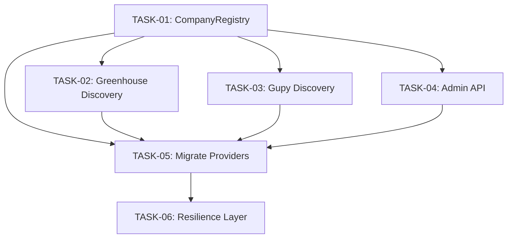

# Tasks — Provider Company Discovery

## Overview

Expand JobFindr's company coverage from ~29 to 250+ companies across 5 providers (Greenhouse, Ashby, Lever, Workday, Gupy) through a hybrid approach of dynamic discovery and admin-managed curated lists.

## Architecture

All tasks are **backend-only**. The frontend is unaffected — company configuration is an internal backend concern. Providers consume company lists from the new `CompanyRegistry` service instead of importing static arrays from `companies.ts`.

## Execution Order & Dependencies

```
TASK-01 (CompanyRegistry) ──┬── TASK-02 (Greenhouse Discovery)
                             ├── TASK-03 (Gupy Discovery)
                             ├── TASK-04 (Admin API)
                             │
TASK-05 (Migrate Providers) ◄── depends on TASK-01 + TASK-02 + TASK-03 + TASK-04
       │
TASK-06 (Resilience Layer) ◄── depends on TASK-05
```

### Dependency Graph



### Validation Gates (Before Starting Build)

| Gate | Test | Owner |
|------|------|-------|
| Gate 1 | `GET https://boards-api.greenhouse.io/v1/boards` — must return 50+ boards | Tech Lead |
| Gate 2 | `GET https://api.lever.co/v0/postings` (no company) — test if returns company metadata | Tech Lead |
| Gate 3 | Gupy search prototype (10 terms) — must discover 20+ careerPageIds in <50 calls | Tech Lead |

## Task List

| ID | Task | Layer | Est. Days | Dependencies |
|----|------|-------|-----------|-------------|
| TASK-01 | [CompanyRegistry Service](./TASK-01-company-registry.md) | Backend | 1-2 | None |
| TASK-02 | [Greenhouse Dynamic Discovery](./TASK-02-greenhouse-discovery.md) | Backend | 1-2 | TASK-01 |
| TASK-03 | [Gupy Search-Based Discovery](./TASK-03-gupy-discovery.md) | Backend | 2-3 | TASK-01 |
| TASK-04 | [Admin Company API](./TASK-04-admin-company-api.md) | Backend | 2 | TASK-01 |
| TASK-05 | [Migrate Providers to Registry](./TASK-05-migrate-providers-to-registry.md) | Backend | 2-3 | TASK-01, TASK-02, TASK-03, TASK-04 |
| TASK-06 | [Resilience Layer](./TASK-06-resilience-layer.md) | Backend | 2 | TASK-05 |
| | **Total** | | **10-13 days** | |

## Feature Flags

All feature flags defined in `env.ts`:

```env
GREENHOUSE_DYNAMIC_COMPANIES=true
GUPY_DYNAMIC_COMPANIES=true
ASHBY_DYNAMIC_COMPANIES=false
LEVER_DYNAMIC_COMPANIES=false
WORKDAY_DYNAMIC_COMPANIES=false
COMPANY_REGISTRY_TTL_SECONDS=86400
```

## Rollback Strategy

Each provider has an independent feature flag. Setting any flag to `false` reverts that provider to the static `companies.ts` fallback. No code deployment needed — config change only.

## References

- [Strategic Plan](../index.md) — Phase breakdown, provider strategy, key decisions
- [Feasibility Analysis](../feasibility.md) — Technical feasibility, complexity, decision gates
- [Recommendations](../recommendations.md) — Provider-specific approach, resilience gaps
- [Impact Analysis](../impact-analysis.md) — File changes, data flow, migration strategy
- [Risks](../risks.md) — Risk matrix with mitigations
