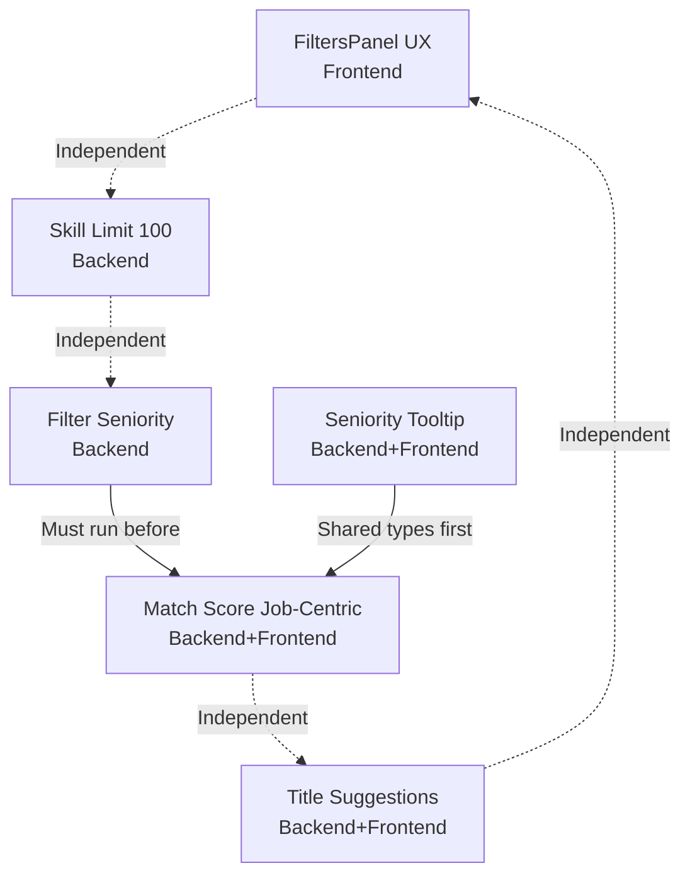

# Tasks Index — Seven Changes Analysis

## Overview
This folder contains 6 technical tasks derived from the 7 proposed changes. Tasks are organized to minimize merge conflicts and respect agent boundaries (frontend vs backend vs shared types).

| Task ID | Title | Agent | Changes Covered | Effort |
|---------|-------|-------|-----------------|--------|
| TASK-01 | FiltersPanel Seniority UX Polish | Senior Frontend | 4 + 7 | Tiny |
| TASK-02 | Increase Skill Limit 30 → 100 | Senior Backend | 5 | Tiny |
| TASK-03 | Filter Seniority for Matchmaking | Senior Backend | 3 | Small |
| TASK-04 | Seniority Match Tooltip | Senior Backend + Senior Frontend | 2 | Small |
| TASK-05 | Match Score Job-Centric Refactor | Senior Backend + Senior Frontend | 1 | Medium |
| TASK-06 | Job Title Suggestions | Senior Backend + Senior Frontend | 6 | Medium |

## Execution Order & Dependencies

### Dependency Graph

### Phased Execution Plan

#### Phase 1: Quick Wins (Parallel — No Dependencies)
These three tasks are completely independent and can run in parallel:

| Order | Task | Agent | Notes |
|-------|------|-------|-------|
| 1a | TASK-01 | Senior Frontend | FiltersPanel.tsx only |
| 1b | TASK-02 | Senior Backend | 3 files, mechanical changes |
| 1c | TASK-06 | Senior Backend + Senior Frontend | Can start backend first |

> **Note:** TASK-06 backend can start in Phase 1; frontend portion can begin once backend API is ready.

#### Phase 2: Seniority & Matchmaking (Sequential)
These tasks have explicit ordering due to shared code regions:

| Order | Task | Agent | Dependency |
|-------|------|-------|------------|
| 2a | TASK-03 | Senior Backend | None (but must complete before TASK-05) |
| 2b | TASK-04 | Senior Backend → Senior Frontend | Requires `@jobfindr/types` build first |
| 2c | TASK-05 | Senior Backend → Senior Frontend | Requires TASK-03 complete; coordinates with TASK-04 |

**Critical Path:** TASK-03 → TASK-05 (both touch `aggregation-service.ts` matchmaking block)

#### Phase 3: Final Integration
After all tasks complete, run full test suite and integration verification.

## Agent Allocation Summary

| Agent | Tasks |
|-------|-------|
| **Senior Backend** | TASK-02, TASK-03, TASK-04 (backend portion), TASK-05 (backend portion), TASK-06 (backend portion) |
| **Senior Frontend** | TASK-01, TASK-04 (frontend portion), TASK-05 (frontend portion), TASK-06 (frontend portion) |

## Coordination Notes

1. **TASK-03 before TASK-05:** Both modify `aggregation-service.ts` near the matchmaking call. Complete TASK-03 first to avoid merge conflicts.

2. **TASK-04 shared types first:** TASK-04 modifies `packages/types/src/match.types.ts`. The types package must be built (`pnpm --filter @jobfindr/types build`) before backend and frontend can consume the new fields.

3. **TASK-04 and TASK-05 both touch `MatchExplanationModal.tsx`:** 
   - TASK-04 adds tooltip attribute to seniority badge
   - TASK-05 changes the content of `matchedSkills`/`unmatchedSkills` displayed in the modal
   - Implement TASK-04 first (adds fields), then TASK-05 (refactors semantics), or coordinate in a single pass

4. **TASK-01 combines Changes 4+7:** Both modify adjacent lines in `FiltersPanel.tsx`. Single task prevents conflicts.

5. **TASK-06 is independent:** Can be worked on at any time. Backend and frontend portions can proceed in parallel once API contract is agreed.

## Validation Checklist

After all tasks complete, verify:

- [ ] FiltersPanel: Seniority capitalized, bold indigo; conditional label works
- [ ] Skill limit: 100 skills accepted, 101 rejected with 400
- [ ] Matchmaking uses filter panel seniority, not modal seniority
- [ ] Match explanation modal: Seniority badge shows tooltip with user/job levels
- [ ] Match score shows "X of Y job skills matched"; matched skills = job skills user has
- [ ] Search bar: Title suggestions appear with briefcase icon and "Title" badge
- [ ] All unit tests pass (backend, frontend, types)
- [ ] No TypeScript compilation errors
- [ ] Playwright visual verification passes

## Related Documents

- Epic breakdown: `.opencode/plan/seven-changes-analysis/recommendations.md`
- Feasibility analysis: `.opencode/plan/seven-changes-analysis/feasibility.md`
- Impact analysis: `.opencode/plan/seven-changes-analysis/impact-analysis.md`
- Risk assessment: `.opencode/plan/seven-changes-analysis/risks.md`