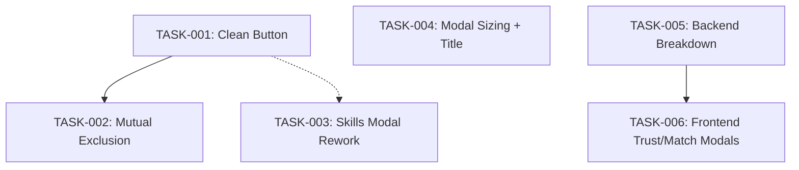

# UX Filter & Modal Changes — Task Overview

**Context:** `ux-filter-modal-changes`
**Date:** 2026-06-03
**Source:** `.opencode/plan/ux-filter-modal-changes/epics/`

## Task Summary

| Task ID | Title | Layer | Agent | Epic | Dependencies |
|---------|-------|-------|-------|------|-------------|
| TASK-001 | Clean Button on AutocompleteInput | Frontend | Senior Frontend | EPIC-01 | None |
| TASK-002 | Company Mutual Exclusion | Frontend | Senior Frontend | EPIC-01 | TASK-001 |
| TASK-003 | Your Skills Modal Save/Discard Rework | Frontend | Senior Frontend | EPIC-02 | TASK-001 (optional) |
| TASK-004 | Job Detail Modal 70% Sizing + Title | Frontend | Senior Frontend | EPIC-03 | None |
| TASK-005 | Backend Trust & Match Breakdown Data | Backend | Senior Backend | EPIC-04 | None |
| TASK-006 | Frontend Trust & Match Explanation Modals | Frontend | Senior Frontend | EPIC-04 | TASK-005 |

## Execution Phases

```
Phase 1 (parallel):
┌─────────────────────┐   ┌─────────────────────┐   ┌─────────────────────┐
│ TASK-001 (FE)       │   │ TASK-004 (FE)        │   │ TASK-005 (BE)       │
│ Clean Button        │   │ Modal Sizing + Title │   │ Backend Breakdown   │
│ No deps             │   │ No deps              │   │ No deps             │
└─────────┬───────────┘   └─────────┬───────────┘   └──────────┬──────────┘
          │                         │                          │
Phase 2 (sequential after 001):
          │                         │                          │
┌─────────▼───────────┐             │                          │
│ TASK-002 (FE)       │             │                          │
│ Mutual Exclusion    │             │                          │
│ Depends: TASK-001   │             │                          │
└─────────┬───────────┘             │                          │
          │                         │                          │
┌─────────▼───────────┐             │                          │
│ TASK-003 (FE)       │             │                          │
│ Skills Modal Rework │             │                          │
│ Depends: TASK-001   │             │                          │
│ (optional)          │             │                          │
└─────────┬───────────┘             │                          │
          │                         │                          │
Phase 3 (after TASK-005):
          │                         │                          │
          │                         │                          ▼
          │                         │            ┌─────────────────────────┐
          │                         │            │ TASK-006 (FE)           │
          │                         │            │ Trust/Match Modals      │
          │                         │            │ Depends: TASK-005       │
          │                         │            └─────────────────────────┘
```

## Dependency Graph



## Agent Allocation

| Agent | Tasks | Order |
|-------|-------|-------|
| **Senior Frontend** | TASK-001, TASK-002, TASK-003, TASK-004, TASK-006 | 001 → 002 → 003, 004 (parallel with 001), then 006 after 005 |
| **Senior Backend** | TASK-005 | Standalone, can run in Phase 1 |

## Key Constraints

- **Backward compatibility**: All changes must maintain backward compatibility. Old API responses without breakdown data must not break the UI (TASK-006).
- **Provider isolation**: Each provider fails independently (no changes needed, existing pattern).
- **Stateless**: No user accounts or personal data stored (no changes needed).
- **Frontend zero business logic**: All scoring/calculation stays in backend (TASK-005).
- **Tests required**: Every task must include or update tests for the modified components.
