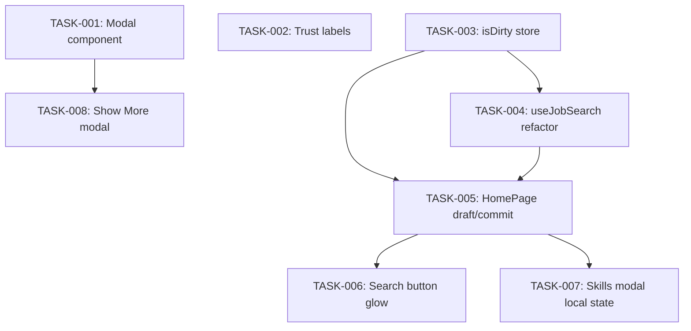

# UX Fix Plan — Tasks Overview

**Date:** 2026-06-03
**Context:** ux-fix-plan
**Agent Allocation:** All tasks are Senior Frontend (no backend work in MVP scope)
**MVP Scope:** Epics 01, 02, 03, 04 (EPIC-05 is follow-up, deferred)

---

## Task Summary

| ID | Task Name | Epic | Effort | Files | Agent |
|----|-----------|------|--------|-------|-------|
| TASK-001 | Create reusable Modal component | EPIC-01 | Small | 2 (1 new + 1 test) | Senior Frontend |
| TASK-002 | Add trust descriptions to slider | EPIC-01 | Small | 2 (1 modify + 1 test update) | Senior Frontend |
| TASK-003 | Add isDirty state and commitSearch action to search store | EPIC-02 | Small | 1 | Senior Frontend |
| TASK-004 | Refactor useJobSearch to accept committed params | EPIC-02 | Medium | 2 (1 modify + 1 test new) | Senior Frontend |
| TASK-005 | Implement draft/commit pattern in HomePage | EPIC-02 | Large | 3 (1 modify + 2 test) | Senior Frontend |
| TASK-006 | Add search button glow animation | EPIC-02 | Small | 2 (1 modify + 1 test update) | Senior Frontend |
| TASK-007 | Refactor UserSkillsModal to use local state | EPIC-03 | Medium | 2 (1 modify + 1 test update) | Senior Frontend |
| TASK-008 | Convert ExpandableDescription to use Modal | EPIC-04 | Small | 2 (1 modify + 1 test new) | Senior Frontend |

---

## Dependency Graph

```
         ┌─────────────────┐
         │   TASK-001      │ (EPIC-01: Modal component)
         │   No deps       │
         └────────┬────────┘
                  │
         ┌────────▼────────┐
         │   TASK-008      │ (EPIC-04: Show More modal)
         │   Dep: TASK-001 │
         └─────────────────┘

         ┌─────────────────┐
         │   TASK-002      │ (EPIC-01: Trust labels)
         │   No deps       │
         └─────────────────┘

         ┌─────────────────┐
         │   TASK-003      │ (EPIC-02: isDirty store)
         │   No deps       │
         └────────┬────────┘
                  │
         ┌────────▼────────┐
         │   TASK-004      │ (EPIC-02: useJobSearch refactor)
         │   Dep: TASK-003 │  (uses committed params type)
         └────────┬────────┘
                  │
         ┌────────▼────────┐
         │   TASK-005      │ (EPIC-02: HomePage draft/commit)
         │   Dep: TASK-003 │
         │   Dep: TASK-004 │
         └────────┬────────┘
                  │
         ┌────────▼────────┐    ┌─────────────────┐
         │   TASK-006      │    │   TASK-007      │ (EPIC-03: Skills modal)
         │   Dep: TASK-005 │    │   Dep: TASK-005 │
         └─────────────────┘    └─────────────────┘
```

### Mermaid Diagram



---

## Execution Order

### Phase 1 — Foundation (parallel, no deps)
1. **TASK-001** (EPIC-01): Create reusable Modal component
2. **TASK-002** (EPIC-01): Add trust descriptions to slider
3. **TASK-003** (EPIC-02): Add isDirty state to search store

### Phase 2 — Search Flow Rework (sequential)
4. **TASK-004** (EPIC-02): Refactor useJobSearch hook
5. **TASK-005** (EPIC-02): Implement draft/commit in HomePage
6. **TASK-006** (EPIC-02): Add search button glow animation

### Phase 3 — Dependent Components (parallel after Phase 2)
7. **TASK-007** (EPIC-03): UserSkillsModal local state (depends on TASK-005)
8. **TASK-008** (EPIC-04): Show More as Modal (depends on TASK-001)

---

## Validation Checklist

- [ ] All tasks reference their source epic
- [ ] Each task is implementable by one developer in one session
- [ ] Dependencies are declared and resolvable
- [ ] No circular dependencies exist
- [ ] Tasks respect the MVP scope (Epics 01-04 only)
- [ ] All files to modify have been identified
- [ ] Backend work is explicitly excluded from this cycle

---

## Notes

- **EPIC-05 (Match & Trust explanation modals):** Deferred to follow-up cycle. Requires Modal component (TASK-001) and backend breakdown work.
- **Sort bug (Change 1):** Naturally fixed by EPIC-02 search flow rework (TASK-003 to TASK-006). No separate task needed.
- **All tasks are frontend-only.** No backend or shared-package changes in this cycle.
- **Testing is mandatory.** Each task must include test creation or updates.
