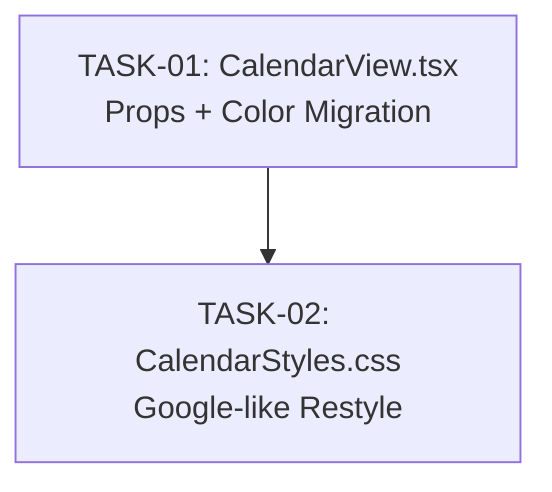

# Calendar UI — Google Calendar Design: Task Index

## Overview

Two implementation tasks to transform the FullCalendar v6.1-based calendar to visually resemble Google Calendar while maintaining the BrkRoutnXdle teal-coral-gold design system.

**Approach:** Deep CSS Theming of FullCalendar (Approach 1 from design analysis)
**Effort:** 2–3 days
**Risk:** Low
**Owner:** senior-frontend (both tasks)

Both tasks are frontend-only. No backend, no packages, no API changes.

---

## Execution Order

```
TASK-01 (CalendarView.tsx prop changes + color migration)
    │
    └──▶ TASK-02 (CalendarStyles.css Google-like restyle)
```

**Total parallel chains:** 1 (sequential — TASK-02 depends on `.brk-calendar-google` class from TASK-01)

---

## Dependency Graph



### Dependency Rationale

TASK-01 adds the `.brk-calendar-google` CSS class to the wrapper `<div>` in `CalendarView.tsx`. TASK-02 scopes all CSS overrides under `.brk-calendar-google`. Without the wrapper class, the CSS rules would have no effect. This is a true architectural dependency — the scoping contract must exist before the styles can apply.

No other dependencies exist. Both tasks modify different files (`CalendarView.tsx` vs `CalendarStyles.css`), so there is no file-level conflict.

---

## Ownership Mapping

| Task | Owner | File(s) | Est. Effort |
|------|-------|---------|-------------|
| TASK-01 | senior-frontend | `apps/web/src/components/CalendarView.tsx` | 4–6 hours |
| TASK-02 | senior-frontend | `apps/web/src/styles/CalendarStyles.css` | 1–2 days |

**Total estimated effort:** 2–3 days

---

## Task Summary

### TASK-01 — CalendarView.tsx: FullCalendar prop additions and hardcoded color migration

**Status:** Pending

**Changes:**
- Add `weekNumbers={true}`, `allDaySlot={true}`, `allDayText="All day"`, `eventTimeFormat`, `dayHeaderFormat` props
- Remove `allDaySlot={false}`
- Add `className="brk-calendar-google"` to wrapper `<div>`
- Remove `backgroundColor`, `borderColor`, `textColor` from all event mapping objects
- Preserve `classNames` arrays on all events
- Preserve `display: 'auto'` on recurring block events to avoid all-day slot

### TASK-02 — CalendarStyles.css: Comprehensive Google Calendar-like restyle

**Status:** Pending (depends on TASK-01)

**Changes:**
- Scope all overrides under `.brk-calendar-google`
- Clean white grid with subtle gray lines
- Compact event chips with colored left border (teal/coral/sky)
- All-day slot with cream background
- Week numbers in month view
- Red now-indicator line
- Gold today-cell highlight
- Smooth hover effects (teal glow, lift)
- Compact time gutter
- All colors use `--clr-*` design tokens

---

## File Structure

```
.opencode/plan/calendar-ui-google-design/
├── design-docs/
│   └── approach-analysis.md
├── planning/
│   ├── index.md
│   ├── feasibility.md
│   ├── impact-analysis.md
│   └── risks.md
└── tasks/
    ├── index.md          ← You are here
    ├── TASK-01.md         ← CalendarView.tsx changes
    └── TASK-02.md         ← CalendarStyles.css restyle
```

---

## Validation Checklist (Post-Implementation)

- [ ] `cd apps/web && pnpm build` passes
- [ ] `cd apps/web && pnpm lint` passes
- [ ] Calendar renders with Google-like appearance in month, week, and day views
- [ ] All 4 event types (generated, external, block, preview) render with correct colors
- [ ] All 3 block types (SingleDay, RecurringWeekday, RecurringPeriod) render correctly
- [ ] Drag-and-drop, resize, select, click, delete interactions all preserved
- [ ] Now indicator, today highlight, hover effects all working
- [ ] Week numbers visible in month view
- [ ] All-day slot visible in day/week views
- [ ] Block events not rendering in all-day slot
