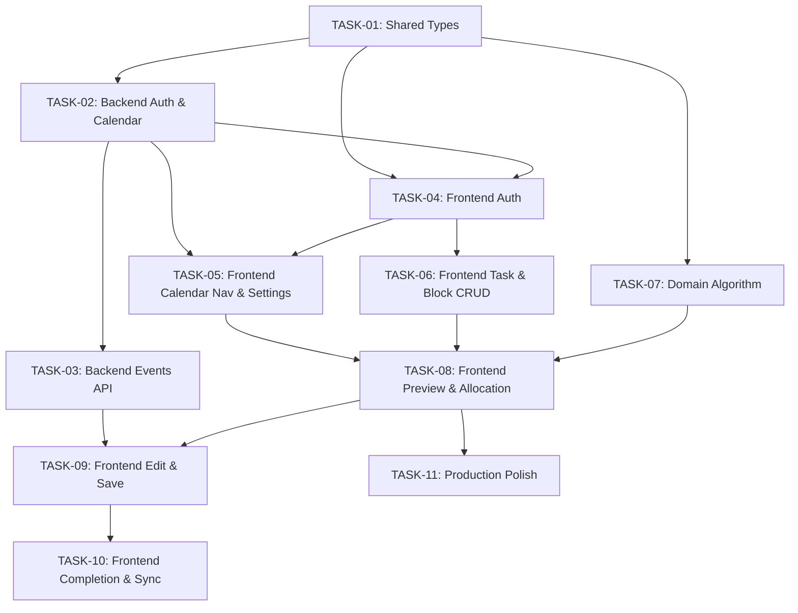

# BrkRoutnXdle — Implementation Task Index

## Overview

11 implementation tasks derived from 7 approved epics. Tasks are designed to maximize parallel execution across senior-frontend and senior-backend agents while respecting true dependency chains.

---

## Task List

| ID | Title | Owner | Epic | Dependencies | Est. Effort | Status |
|----|-------|-------|------|-------------|-------------|--------|
| TASK-01 | Shared Types & Package Scaffolding | senior-backend | EPIC-01 | None | Small | **Partially done** (types complete, scaffolding provided) |
| TASK-02 | Backend Auth & Calendar Setup | senior-backend | EPIC-01 | TASK-01 | Large | Pending (full code in tasks/references/) |
| TASK-03 | Backend Events API | senior-backend | EPIC-01, EPIC-05, EPIC-06 | TASK-02 | Large | Pending (full code in tasks/references/) |
| TASK-04 | Frontend Authentication Flow | senior-frontend | EPIC-01 | TASK-01, TASK-02 | Medium | Pending (full code in tasks/references/) |
| TASK-05 | Frontend Calendar Navigation & Settings | senior-frontend | EPIC-03 | TASK-04, TASK-02 | Large | Pending (full code in tasks/references/) |
| TASK-06 | Frontend Task & Block Definition | senior-frontend | EPIC-02 | TASK-04 | Large | Pending (full code in tasks/references/) |
| TASK-07 | Domain Schedule Generation Algorithm | senior-backend | EPIC-04 | TASK-01 | Large | Pending (full code in tasks/references/) |
| TASK-08 | Frontend Schedule Preview & Allocation | senior-frontend | EPIC-04 | TASK-05, TASK-06, TASK-07 | Large | Pending (full code in task file) |
| TASK-09 | Frontend Manual Editing & Save | senior-frontend | EPIC-05 | TASK-08, TASK-03 | Large | Pending (full code in tasks/references/) |
| TASK-10 | Frontend Completion, Sync & Conflict | senior-frontend | EPIC-06 | TASK-09 | Medium | Pending (full code in task file) |
| TASK-11 | Production Polish | senior-frontend | EPIC-07 | TASK-08 | Large | Pending (full code in tasks/references/) |

---

## Execution Order

### Phase 1: Foundation (All agents)
```
Week 1-2:
  TASK-01 [senior-backend]  ← Start immediately
  ├── TASK-02 [senior-backend] ← After TASK-01
  │   └── TASK-03 [senior-backend] ← After TASK-02
  └── TASK-04 [senior-frontend] ← After TASK-01 + TASK-02 (can overlap with TASK-03)
      ├── TASK-05 [senior-frontend] ← After TASK-04 + TASK-02
      └── TASK-06 [senior-frontend] ← After TASK-04 (parallel with TASK-05)
  TASK-07 [senior-backend] ← After TASK-01 (parallel with TASK-02/03/05/06)
```

### Phase 2: Core Value (Both agents)
```
Week 3-4:
  TASK-08 [senior-frontend] ← After TASK-05 + TASK-06 + TASK-07
  TASK-09 [senior-frontend] ← After TASK-08 + TASK-03
  TASK-10 [senior-frontend] ← After TASK-09
```

### Phase 3: Polish (Frontend only)
```
Week 5-6:
  TASK-11 [senior-frontend] ← After TASK-08 (iterative, overlaps TASK-09/10)
```

---

## Dependency Graph



---

## Parallelization Opportunities

### Safe Parallel Work

| Parallel Group | Tasks | Agents | Prerequisite |
|---------------|-------|--------|-------------|
| **Group A** | TASK-02 (backend) + TASK-04 (frontend) | both | TASK-01 complete |
| **Group B** | TASK-03 (backend) + TASK-05 (frontend) | both | TASK-02, TASK-04 active |
| **Group C** | TASK-05 (frontend) + TASK-06 (frontend) | one agent (sequential for same agent) | TASK-04 complete |
| **Group D** | TASK-05/06 (frontend) + TASK-07 (backend) | both | TASK-04, TASK-01 complete |
| **Group E** | TASK-09 (frontend) + TASK-11 (frontend polish starts) | one agent | TASK-08 complete |
| **Group F** | TASK-10 (frontend) + TASK-11 (frontend continues) | one agent | TASK-09 complete |

### Maximum Parallelism Strategy

1. **Week 1**: Backend starts TASK-01. Frontend starts after TASK-01.
2. **Week 1-2**: Backend works TASK-02 → TASK-03. Frontend works TASK-04 → TASK-05 + TASK-06.
3. **Week 2**: Backend starts TASK-07 (algorithm) in parallel with TASK-03 finalization.
4. **Week 3**: Both agents join on integration — frontend takes TASK-08 once TASK-05/06/07 are done.
5. **Week 4-5**: Frontend continues with TASK-09 → TASK-10 → TASK-11 (polish overlaps).
6. **Backend**: Potentially idle after TASK-07 — can support frontend integration or start test infrastructure.

---

## Ownership Mapping

### senior-backend (4 tasks)
| Task | Title | Epic |
|------|-------|------|
| TASK-01 | Shared Types & Package Scaffolding | EPIC-01 |
| TASK-02 | Backend Auth & Calendar Setup | EPIC-01 |
| TASK-03 | Backend Events API | EPIC-01/05/06 |
| TASK-07 | Domain Schedule Generation Algorithm | EPIC-04 |

### senior-frontend (7 tasks)
| Task | Title | Epic |
|------|-------|------|
| TASK-04 | Frontend Authentication Flow | EPIC-01 |
| TASK-05 | Frontend Calendar Navigation & Settings | EPIC-03 |
| TASK-06 | Frontend Task & Block Definition | EPIC-02 |
| TASK-08 | Frontend Schedule Preview & Allocation | EPIC-04 |
| TASK-09 | Frontend Manual Editing & Save | EPIC-05 |
| TASK-10 | Frontend Completion, Sync & Conflict | EPIC-06 |
| TASK-11 | Production Polish | EPIC-07 |

---

## Backend Idle Risk

After TASK-07 (algorithm), the senior-backend has no remaining tasks. Options for backend agent after TASK-07:

1. **Add integration/E2E test infrastructure**
2. **Performance profiling** of the algorithm with real data
3. **API documentation** (OpenAPI/Swagger spec)

Recommend leveraging this idle period for these tasks.

---

## Risks & Recommendations

### Risks

| Risk | Impact | Mitigation |
|------|--------|------------|
| TASK-01 blocks all parallel work | Schedule delay if delayed | Keep TASK-01 small and focused; define minimal viable types first |
| TASK-07 (algorithm) is high-risk for quality issues | Core product value | Extensive unit testing required in TASK-07; define interface contracts in TASK-01 |
| Backend idle after TASK-07 | Resource underutilization | Pre-plan post-algorithm work (see above); assign test infrastructure |
| TASK-11 scope is broad | Scope creep | Split into iterative sub-tasks; begin with design tokens, then accessibility, then mobile |
| FullCalendar mobile touch support | Mobile UX issues | Test FullCalendar touch interactions early in TASK-05; have fallback plan |

### Recommendations

1. **TASK-01 should ship fast** — define only the types needed by downstream tasks. Additive type changes are fine.
2. **Interface-first for TASK-07** — define the `generateSchedule()` function signature in TASK-01 so frontend can mock it during TASK-08 development while backend implements the real algorithm.
3. **TASK-11 can start early** — design tokens (CSS custom properties) can be defined as soon as TASK-05 starts, since components need styling.
4. **Parallel validation** — both agents should validate their work against the integration test suite before declaring done.
5. **Weekly sync points** — after TASK-04 (Week 1) and after TASK-08 (Week 3) for integration verification.

---

## Implementation Code Reference Files

Tasks with large scope have been split into continuation files in `tasks/references/`:

| Task | Reference Files |
|------|----------------|
| TASK-02 | `references/TASK-02-impl-guide-part2.md`, `references/TASK-02-impl-guide-part3.md` |
| TASK-03 | `references/TASK-03-impl-guide-part2.md`, `references/TASK-03-impl-guide-part3.md` |
| TASK-04 | `references/TASK-04-impl-guide-part2.md` |
| TASK-05 | `references/TASK-05-impl-guide-part2.md` |
| TASK-06 | `references/TASK-06-impl-guide-part2.md` |
| TASK-07 | `references/TASK-07-impl-guide-part2.md`, `references/TASK-07-impl-guide-part3.md`, `references/TASK-07-impl-guide-part4.md` |
| TASK-09 | `references/TASK-09-impl-guide-part2.md` |
| TASK-11 | `references/TASK-11-impl-guide-part2.md` |

Each reference file contains complete, copy-paste-ready TypeScript code with exact file paths.

---

## References

- `plan/documentation-analysis/epics/index.md` — Approved epics
- `architecture/architecture.md` — System architecture
- `architecture/monorepo-structure.md` — Monorepo structure
- `architecture/package-contracts.md` — Package boundaries
- `tasks/references/` — Continuation files with exact implementation code
