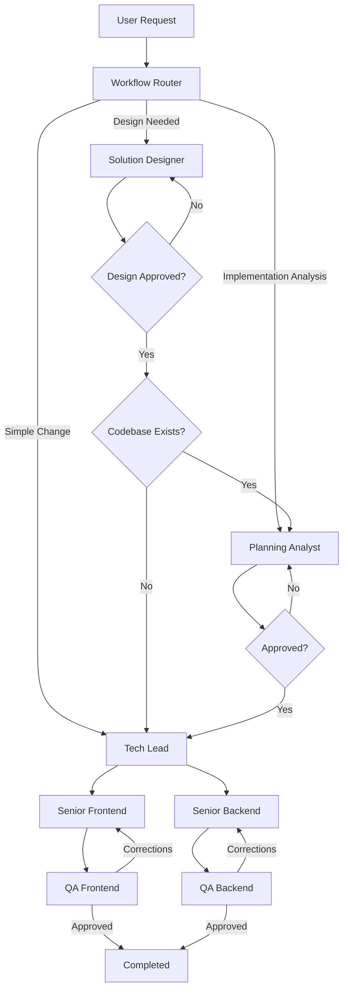

# Delivery Pipeline Skill

## Purpose

Orchestrate the complete software delivery workflow from an initial user request through planning, task creation, implementation, review, and completion.

This skill is the single entry point for project execution and is responsible for workflow orchestration, state persistence, recovery after interruptions, and information handoff between agents.

## Templates

All templates are stored in `.opencode\template` and template variables are inside `.opencode\template\variables.md`

### Variable Resolution

Before dispatching any agent, the orchestrator MUST:
1. Read `variables.md` to load all variable definitions
2. Resolve `[PLAN_FOLDER_LOCATION]` by substituting `<context>` with `pipeline.yaml.name`
3. Resolve all dependent variables (`[DESIGN_FOLDER_LOCATION]`, `[TASKS_FOLDER_LOCATION]`, etc.)
4. Pass the resolved values to the agent as part of the execution context

Example:
- `pipeline.yaml.name = "documentation-analysis"`
- `[PLAN_FOLDER_LOCATION]` resolves to `.opencode/plan/documentation-analysis`
- `[DESIGN_FOLDER_LOCATION]` resolves to `.opencode/plan/documentation-analysis/design-docs`

## Commands

### New Execution

```text
delivery-pipeline:new
```

Starts a new delivery workflow.

Responsibilities:

1. Generate a context name.
2. Create the planning folder structure using the `create-folder-structure` tool. The tool creates `design-docs/`, `planning/`, and `tasks/` subfolders. If the selected workflow does not use all folders, unused ones remain empty — this is expected.
3. Create [PIPELINE_FILE] using [PIPELINE_TEMPLATE_FILE].
4. Invoke the Workflow Router skill.
5. Execute the selected workflow.
6. Persist progress after every agent execution.

### Resume Execution

```text
delivery-pipeline:resume
```

Resumes the last execution from [PIPELINE_FILE].

Responsibilities:

1. Validate `pipeline.yaml` parses via `read-pipeline-state`. If it fails (e.g., duplicate YAML keys), repair/rewrite the file first, then load state.
2. Load pipeline state.
3. Identify incomplete steps.
4. Resume execution from the last known state.
5. Avoid re-executing completed work.

## Pipeline State

Pipeline state is stored in:

```text
[PIPELINE_FILE]
```

The pipeline file is the source of truth for workflow execution.
It must be updated after every agent execution by the orchestrator.

## Responsibilities

### Workflow Orchestration

Responsible for:

* Invoking Workflow Router
* Invoking Solution Designer
* Invoking Planning Analyst
* Invoking Tech Lead
* Invoking Senior Frontend agents
* Invoking Senior Backend agents
* Invoking QA Frontend
* Invoking QA Backend

### State Management

Responsible for:

* Creating pipeline state
* Updating pipeline state
* Tracking execution progress
* Tracking task completion
* Tracking errors
* Tracking concerns
* Maintaining execution history
* Supporting workflow recovery

### Agent Dispatch Rules

**Primary agents** (Planning Analyst, Solution Designer) are defined with `mode: primary` in their agent files. They must be dispatched using their proper agent type name via `task` with `subagent_type` matching the agent name. Do NOT dispatch primary agents as `general` or any other type — this skips their workflow and prevents file creation.

**Subagents** (Senior Frontend, Senior Backend, QA) use `mode: subagent` and are dispatched using their proper agent type name via `task` with `subagent_type` matching the agent name, with their task instructions inline.

**QA dispatch naming:** "QA Frontend" and "QA Backend" are review AREAS, not agent type names. QA work is always dispatched as `subagent_type: "QA Reviewer"` — one instance per review area (frontend or backend). Dispatching `subagent_type: "QA Backend"` or `"QA Frontend"` directly is INVALID and fails with `Unknown agent type`. The review area is passed in the task prompt, not as the agent type.

**Dispatch stalls/failures:** If a named agent dispatch fails or stalls (e.g., a model-resolution error such as `Model not found: opencode/...`), retry the SAME dispatch up to 3 consecutive attempts. If all 3 attempts fail, ABORT the step and REPORT the error — never fall back to dispatching as `general` or any other agent type to work around a failed dispatch.

### Orchestrator Must Never Do Agent Work

The orchestrator must **never** implement, write, or modify source code directly. Its sole responsibility is dispatching agents, managing state, and passing context.

If an agent:
- Returns an error → re-call the same agent with the error context
- Returns a partial result → re-call to complete the remaining work
- Returns non-standard format → re-call with format requirements
- Asks a question → respond to the agent directly (do not resolve it yourself)
- Times out → verify output dir; if files were created, mark done; otherwise re-call with higher timeout

**Never fix agent output yourself.** If an agent's code has a bug or build error, re-call the agent with the error details. Do not edit the agent's files, run build commands, or patch the code manually.

**Never run validation commands yourself.** Build, lint, and typecheck commands are the responsibility of subagents and QA. The orchestrator only dispatches agents and updates pipeline state.

If the orchestrator needs to make any code change, it must dispatch an agent to do it.

### Information Handoff

The orchestrator must provide agents with all available context whenever possible.

The orchestrator should pass the minimum set of information required for execution.

Agents should not need to locate, search, or aggregate project context on their own whenever the information is already available.

Agents should not need to read:

```text
design-docs/
tasks/
planning/
pipeline.yaml
```

unless their role explicitly requires it.

The orchestrator should consolidate and pass:

* User request
* Pipeline context name
* Selected approach
* Approved planning artifacts
* Design summaries (passed from SD to PA when chained)
* Task summaries
* Acceptance criteria
* Relevant dependencies
* Previous execution results

## Workflow



### Step 1 - Route Request

Invoke:

```text
workflow-router
```

The router determines whether the request should be handled by:

* Solution Designer
* Planning Analyst
* Tech Lead

### Solution Designer Flow

When Solution Designer is selected:

1. Execute Solution Designer.
2. Present approaches to the user.
3. Wait for semantic approval.
4. Repeat design loop until approved.
5. Generate design documents.
6. Update pipeline.

If a codebase exists:
  7. Execute Planning Analyst (pass design_summary and design-docs/ path as context).
  8. Present planning analysis to the user.
  9. Wait for semantic approval.
  10. Repeat planning loop until approved.
  11. Generate planning documents.
  12. Update pipeline.
  13. Execute Tech Lead.

If no codebase exists:
  7. Execute Tech Lead directly.

Design documents must not be created before approval.
Planning documents must not be created before approval.

### Planning Flow

When Planning Analyst is selected:

1. Execute Planning Analyst as a primary agent — invoke using the agent's full workflow directly (not via `task` with `subagent_type`).
2. Present approaches to the user.
3. Wait for semantic approval.
4. Repeat planning loop until approved.
5. Planning Analyst generates planning documents (index.md, feasibility.md, impact-analysis.md, risks.md) in `[PLAN_FOLDER_LOCATION]`.
6. Orchestrator MUST verify planning files were physically created before proceeding. If files are missing, re-dispatch the Planning Analyst with the file creation requirement.
7. Update pipeline.
8. Execute Tech Lead.

Planning documents must not be created before approval.

### Tech Lead Flow

Execute Tech Lead.

Expected outputs:

* Task files
* Task dependencies
* Ownership assignments
* Execution order

Update pipeline.

### Parallel Development Phase

Read task ownership and dependencies.

Tasks without unmet dependencies may execute immediately.

The orchestrator must maximize parallel execution whenever dependencies allow.

### Parallel Execution Phase

Dispatch **multiple** Senior Frontend/Backend agents simultaneously when independent tasks are available. Do not limit to one agent per role — if 3 frontend tasks are independent, create 3 Senior Frontend agents in parallel. Each agent receives exactly one task.

Pass:

* Assigned task (one per agent)
* Acceptance criteria
* Relevant context
* Dependency information
* Task file path for exact step-by-step code
* Standard response format requirement — instruct the agent to return using the [standard agent response format](references/agent-response-format.md)

Update pipeline after every completed task.

**Important: one agent per task** — never assign multiple tasks to a single agent if they can run in parallel.

### Concurrent File Modification Prevention

When multiple tasks modify the same file, assign them sequentially or use a merge strategy. Review task file lists for overlaps before parallel dispatch. If overlap is detected, choose one of:

1. **Sequence**: Run tasks that touch the same file sequentially, in a logical order (e.g., type changes first, then component changes, then layout changes).
2. **Parallel with non-overlapping sections**: If tasks affect clearly separate sections of the same file (different functions, different JSX branches), dispatch in parallel and instruct each agent to only modify its designated lines.
3. **Merge agent**: When 3+ tasks overlap on the same file, consider dispatching a single agent with all related tasks to minimize merge conflicts.

The Tech Lead should flag file overlaps in the task metadata so the orchestrator can plan the dispatch order early.

### QA Phase

Execute:

* QA Frontend
* QA Backend

in parallel whenever possible.

Provide:

* Original task
* Acceptance criteria
* Relevant implementation context
* Git diff for files modified by the reviewed task

QA validates implementation against requirements.

Exactly one QA Frontend instance reviews frontend work.

Exactly one QA Backend instance reviews backend work.

### Corrections Loop

If QA returns:

```text
Corrections Needed
```

The orchestrator must:

1. Update pipeline.
2. Send feedback to the responsible implementation agent.
3. Re-execute implementation.
4. Re-execute QA.

Repeat until approved.

### Completion

Workflow completes when:

* All tasks are completed
* All QA reviews are approved
* No pending work remains

Upon completion, the orchestrator MUST:

1. Update `pipeline.yaml` status to `completed`, record final errors/concerns, set `updated_at`.
2. Invoke the mandatory STOP chain: load `learning-improvement` skill → after it completes, load `continuous-learning` skill → after it completes, load `session-save` skill.
3. Do NOT return to the user or end the session before the STOP chain completes. The STOP chain is part of the pipeline, not optional cleanup.

## Parallelization Rules

See [references/parallelization-rules.md](references/parallelization-rules.md)

## Failure Recovery

See [references/failure-recovery.md](references/failure-recovery.md)

## Pipeline Updates

After EVERY agent dispatch completes, BEFORE dispatching the next agent, update `pipeline.yaml` with:

* The completed step's status (completed / failed / errors)
* errors and concerns returned by the agent
* updated_at timestamp

This is mandatory — missed updates cause recovery failures and loss of execution history.

Validate the file after every write: call `read-pipeline-state` before dispatching the next agent. An invalid `pipeline.yaml` (e.g., duplicate YAML keys under a step) blocks recovery and must be repaired first.

After every agent execution update:

* status
* notes
* updated_at
* errors
* concerns

and append a history record.

Implementation task status must also be updated.

Examples:

[ ] TASK-01 Create User Endpoint
[X] TASK-02 Create User Screen

Errors and concerns examples:

```
errors:
  - "Build failed (TS error: info.event.revert() possibly undefined)"
  - "Subagent created files outside task scope (test helper script)"
concerns:
  - "Shell blocked npx tsc — subagent used pnpm build workdir instead"
  - "Subagent could not verify lint (no lint script configured)"
```

### Pipeline Completion

When all steps are completed (all tasks approved by QA):
1. Update `pipeline.status` to `completed`
2. Invoke the STOP chain: `learning-improvement` → `continuous-learning` → `session-save`

## References

- [Standard Agent Response Format](references/agent-response-format.md) — includes Validation Gate and Step Limit guidelines
- [Task Tracking](references/task-tracking.md)
- [Parallelization Rules](references/parallelization-rules.md)
- [Failure Recovery](references/failure-recovery.md)
- [Constraints](references/constraints.md)

## Constraints

See [references/constraints.md](references/constraints.md) for the full constraint list.
