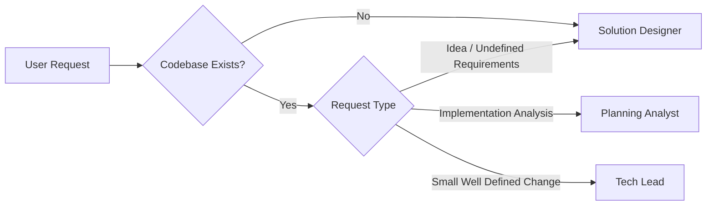

# Workflow Router Skill

## Purpose

Determine which workflow path should be executed.

The router never creates files and never modifies source code.

Its only responsibility is selecting the correct entry point.

## Decision Tree



## Routing Rules

### Route to Solution Designer

Use when:

- No codebase exists
- Requirements are unclear
- User provides only a high-level idea
- Design exploration is needed
- Multiple approaches need evaluation

When a codebase exists, the pipeline automatically chains Planning Analyst after Solution Designer
to validate design decisions against the actual code.

Examples:

- "I want to build a school system"
- "I have an idea for an app"
- "Help me design the approach for X"
- "What are the options for implementing Y?"

### Route to Planning Analyst

Use when:

- Codebase already exists
- User requests analysis
- User requests feasibility evaluation
- User requests architectural guidance
- User requests medium or large changes
- Implementation approach is known and only feasibility/impact analysis is needed

Examples:

- "Add multi-tenancy"
- "Migrate authentication to OAuth"
- "What could break if we change X?"

### Route to Tech Lead

Use when:

- Requirements are already defined
- Scope is small
- Implementation approach is obvious
- Planning is unnecessary

Examples:

- "Add a column to the user table"
- "Create an endpoint for X"
- "Add validation to Y"

## Complexity Classification

### Small

Characteristics:

- Single layer affected
- Low risk
- Obvious implementation
- No architectural impact

Route:

```text
Tech Lead
```

### Medium

Characteristics:

- Multiple files
- Multiple possible approaches
- Architectural decisions required

Route:

```text
Planning Analyst
```

### Large

Characteristics:

- Cross-cutting changes
- Significant architectural impact
- High implementation risk

Route:

```text
Planning Analyst
```

## Output

Return:

```yaml
route: solution-designer | planning-analyst | tech-lead

reason: "<why the route was selected>"

complexity: small | medium | large
```

## Constraints

- Never create files
- Never modify source code
- Never execute implementation tasks
- Never generate design documents
- Never generate planning documents
- Never generate technical tasks
- Only classify and route requests
- Prefer Tech Lead when planning is unnecessary
- Prefer Planning Analyst when the implementation goal is clear and only feasibility/impact analysis is needed
- Prefer Solution Designer when requirements are incomplete, design exploration is needed, or no codebase exists